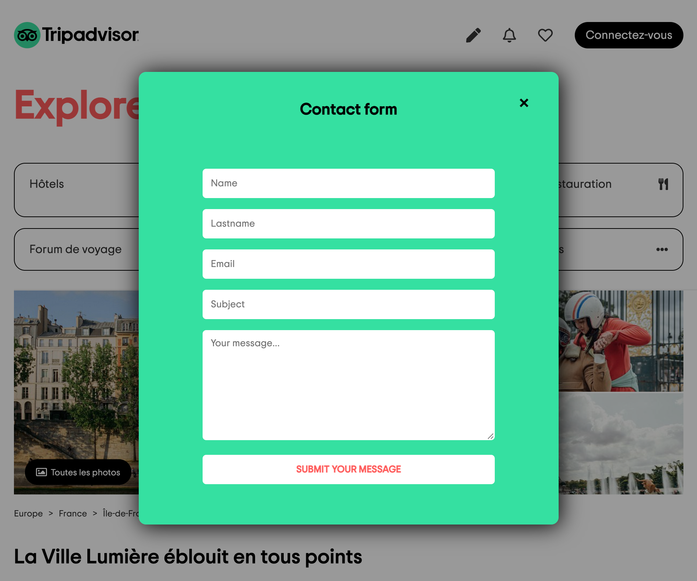

# TRIPADVISOR CLONE 🏖

⛅️ April 2021  
⚙️ Backend  
✨ Frontend - check the frontend [repo](https://github.com/manon-boiteau/TripAdvisor-LeReacteur)  
🔗 Netlify - check [that](https://mytripadvisor-lereacteur-2021.netlify.app/)

## 🌈 Overview - Welcome dude

---

TripAdvisor clone made at [Le Reacteur](https://www.lereacteur.io/) Bootcamp.  
4 screens are availables: TripAdvisor home page for desktop, tablette, mobile and modal contact form.

## 👩🏻‍💻 Tasks

---

✘ Create a server with Express  
✘ Create a endpoint for user's informations (contact form)  
✘ Use mailgun to send a confirmation email

## 📚 Stacks

---

[Javascript](https://www.w3schools.com/js/default.asp)  
[NodeJS](https://nodejs.org/api/documentation.html)
[Express](https://github.com/expressjs/express)  
[Express Formidable](https://github.com/hatashiro/express-formidable)  
[Mailgun](https://documentation.mailgun.com/en/latest/)

## 🗝 Installation and usage

---

Be sure, you have installed all dependencies to run the project.

### 🚙 Running the project

1️. Clone this repository

`git clone https://github.com/manon-boiteau/tripAdvisor-back-LeReacteur.git`

`cd tripAdvisor-back-LeReacteur`

2️. Install packages

`npm install`

3️. When installation is complete:

`node index.js`

🙏🏻 Thank you @LeReacteur.
